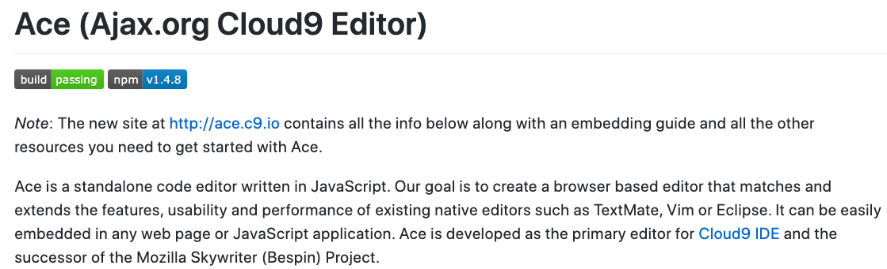
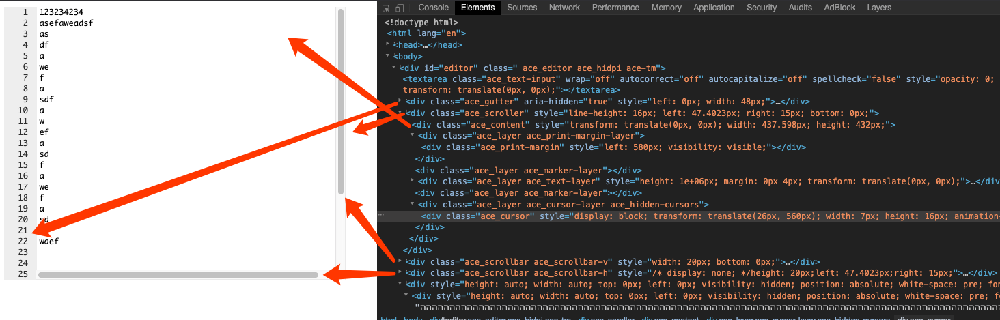
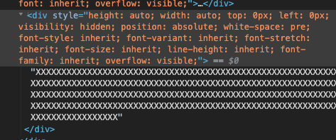
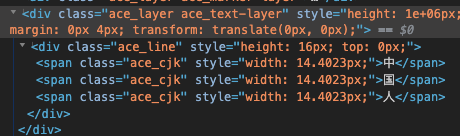
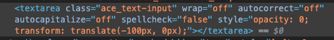
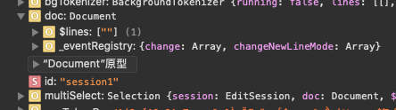

<div style="text-align: center;">
  
</div>

[ace](https://github.com/ajaxorg/ace)富文本编辑器，是一款不错的JavaScript实现的富文本编辑器。它没有采用html的contentEditable实现，而是采用一种自行渲染、类似虚拟DOM的方式实现。我们对阅读了其源码，以期了解其实现原理。

> 大段源码警告

## 入口
使用ace，初始化代码为

```html
<div id="editor">some text</div>
  <script src="build/src/ace.js" type="text/javascript" charset="utf-8"></script>
  <script>
      var editor = ace.edit("editor");
  </script>
```

也就是入口函数为`ace.edit`。在获取ace源码后，运行`node ./Makefile.dryice.js`命令进行build后，在build/src文件夹内可以得到ace完整的源码。在build/src/ace.js文件中找到`edit`函数。

```js
exports.edit = function(el, options) {
    if (typeof el == "string") {
        var _id = el;
        // 只支持dom的ID属性
        el = document.getElementById(_id);
        if (!el)
            throw new Error("ace.edit can't find div #" + _id);
    }

    if (el && el.env && el.env.editor instanceof Editor)
        return el.env.editor;

    var value = "";
    if (el && /input|textarea/i.test(el.tagName)) {
        var oldNode = el;
        value = oldNode.value;
        el = dom.createElement("pre");
        oldNode.parentNode.replaceChild(el, oldNode);
    } else if (el) {
        value = el.textContent;
        el.innerHTML = "";
    }

    // 创建编辑会话
    // 返回EditSession对象
    var doc = exports.createEditSession(value);
    // 创建编辑器
    var editor = new Editor(new Renderer(el), doc, options);

    var env = {
        document: doc,
        editor: editor,
        onResize: editor.resize.bind(editor, null)
    };
    if (oldNode) env.textarea = oldNode;
    event.addListener(window, "resize", env.onResize);
    editor.on("destroy", function() {
        event.removeListener(window, "resize", env.onResize);
        env.editor.container.env = null; // prevent memory leak on old ie
    });
    editor.container.env = editor.env = env;
    return editor;
};
```

### Editor(new Renderer(el), doc, options)


### Renderer：VirtualRenderer

Renderer用到了VirtualRenderer。VietualRender初始化时创建了一些DOM，如下图。
<div style="text-align: center;">
  
</div>

- `ace_gutter`: 显示左侧的行序列
- `ace_scroller`: 包裹正文（`ace_content`）显示部分
- `ace_scrollbar`: 滚动条，分为垂直和水平滚动条

`ace_content`内分为很多层`layer`:

- `ace_print-margin-layer`:
- `ace_marker-layer`:
- `ace_text-layer`:
- `ace_cursor-layer`:

VirtualRenderer指明了光标位置属性。

```js
this.cursorPos = {
    row : 0,
    column : 0
};
```

初始化函数中有一行代码将TextLayer中用于渲染text的dom容器必做canvas

```js
var textLayer = this.$textLayer = new TextLayer(this.content);
this.canvas = textLayer.element;

// layer/text.js
var Text = function(parentEl) {
  this.dom = dom;
  this.element = this.dom.createElement("div");
  this.element.className = "ace_layer ace_text-layer";
  parentEl.appendChild(this.element);
  this.$updateEolChar = this.$updateEolChar.bind(this);
  this.$lines = new Lines(this.element);
};
```

#### TextLayer: layer/text

查看Text的实现，会发现Text利用Lines来操作每一行，并且将`ace_text-layer`高度设置为很大。

```js
// layer/text.js
var Text = function(parentEl) {
    this.dom = dom;
    this.element = this.dom.createElement("div");
    this.element.className = "ace_layer ace_text-layer";
    parentEl.appendChild(this.element);
    this.$updateEolChar = this.$updateEolChar.bind(this);
    this.$lines = new Lines(this.element);
};

// layer/lines.js
var Lines = function(element, canvasHeight) {
    this.element = element;
    // 将`ace_text-layer`高度设置为很大
    this.canvasHeight = canvasHeight || 500000;
    this.element.style.height = (this.canvasHeight * 2) + "px";

    this.cells = [];
    this.cellCache = [];
    this.$offsetCoefficient = 0;
};

```

layer/lines.js中有一些对cells的增删查等操作，例如：`get(index)、shift、pop、push、unshift`，也有创建cell的函数。

```js
this.createCell = function(row, config, session, initElement) {
    var cell = this.cellCache.pop();
    if (!cell) {
        var element = dom.createElement("div");
        if (initElement)
            initElement(element);

        this.element.appendChild(element);

        cell = {
            element: element,
            text: "",
            row: row
        };
    }
    cell.row = row;

    return cell;
};
```

这里注意到一个函数`initElement`函数，这个函数可能与渲染有关。lines.js本身没有调用`createCell`函数。text.js中只有一处调用了:

```js
this.$renderLinesFragment = function(config, firstRow, lastRow) {
  var fragment = [];
  var row = firstRow;
  var foldLine = this.session.getNextFoldLine(row);
  var foldStart = foldLine ? foldLine.start.row : Infinity;

  while (true) {
      if (row > foldStart) {
          row = foldLine.end.row+1;
          foldLine = this.session.getNextFoldLine(row, foldLine);
          foldStart = foldLine ? foldLine.start.row : Infinity;
      }
      if (row > lastRow)
          break;
      // 这里没有传递initElement函数，我们看看renderLine函数
      var line = this.$lines.createCell(row, config, this.session);

      var lineEl = line.element;
      this.dom.removeChildren(lineEl);
      dom.setStyle(lineEl.style, "height", this.$lines.computeLineHeight(row, config, this.session) + "px");
      dom.setStyle(lineEl.style, "top", this.$lines.computeLineTop(row, config, this.session) + "px");

      // Get the tokens per line as there might be some lines in between
      // beeing folded.
      this.$renderLine(lineEl, row, row == foldStart ? foldLine : false);

      if (this.$useLineGroups()) {
          lineEl.className = "ace_line_group";
      } else {
          lineEl.className = "ace_line";
      }
      fragment.push(line);

      row++;
  }
  return fragment;
};
```

实现渲染文本，大致上是通过`$renderLine`>`$renderSimpleLine`>`$renderToken`，通过`$renderToken`中调用dom.createTextNode来创建text节点。

```js
valueFragment.appendChild(this.dom.createTextNode(i ? value.slice(i) : value, this.element));
```

另外，在`$renderToken`函数中，对表意文字（中文、表情等）进行了正则匹配，表意文字的渲染是对每个文字都设置2个字符长度的宽度。

```js
} else if (cjk) {
  screenColumn += 1;
  var span = this.dom.createElement("span");
  span.style.width = (self.config.characterWidth * 2) + "px";
  span.className = "ace_cjk";
  span.textContent = cjk;
  valueFragment.appendChild(span);
}
```

#### CursorLayer:光标层

这里有一点需要注意，ace几乎完美的实现了指哪显示哪。而在自己实现时，发现光标的位置在行首第一个字符前后比较难定位。为解决这个问题，才有了这篇文章。

光标效果实现不用多说，其采用css动画，配合setInterval来实现。

`layer/cursor.js`分析Cursor显示位置是通过`getPixelPosition(position, onScreen)`(onScreen为boolean型)函数来得到。

```js
this.getPixelPosition = function(position, onScreen) {
  if (!this.config || !this.session)
      return {left : 0, top : 0};

  if (!position)
      position = this.session.selection.getCursor();
  var pos = this.session.documentToScreenPosition(position);
  var cursorLeft = this.$padding + (this.session.$bidiHandler.isBidiRow(pos.row, position.row)
      ? this.session.$bidiHandler.getPosLeft(pos.column)
      : pos.column * this.config.characterWidth);

  var cursorTop = (pos.row - (onScreen ? this.config.firstRowScreen : 0)) *
      this.config.lineHeight;

  return {left : cursorLeft, top : cursorTop};
};
```

函数执行过程中，大部分情况入参`position`为`null`，是从`this.session.selection.getCursor()`获取到了cursor所处的**行列**，这一点其实很重要：**如果高精度命中行列**。`pos`和`position`基本相同。
计算cursorLeft又基本上是执行`pos.column * this.config.characterWidth`,其中characterWidth为`7.201171875`，为什么是这个数字？

我们分析layer/font_metrics.js文件，发现了以下几行代码：

```js
var CHAR_COUNT = 256;

this.$measureNode = dom.createElement("div");
    this.$setMeasureNodeStyles(this.$measureNode.style);

this.$measureNode.textContent = lang.stringRepeat("X", CHAR_COUNT);
    
this.$characterSize = {width: 0, height: 0};

this.checkForSizeChanges = function(size) {
    if (size === undefined)
        size = this.$measureSizes();
    if (size && (this.$characterSize.width !== size.width || this.$characterSize.height !== size.height)) {
        this.$measureNode.style.fontWeight = "bold";
        var boldSize = this.$measureSizes();
        this.$measureNode.style.fontWeight = "";
        this.$characterSize = size;
        this.charSizes = Object.create(null);
        this.allowBoldFonts = boldSize && boldSize.width === size.width && boldSize.height === size.height;
        this._emit("changeCharacterSize", {data: size});
    }
};

this.$measureSizes = function(node) {
  var size = {
      height: (node || this.$measureNode).clientHeight,
      width: (node || this.$measureNode).clientWidth / CHAR_COUNT
  };
  
  // Size and width can be null if the editor is not visible or
  // detached from the document
  if (size.width === 0 || size.height === 0)
      return null;
  return size;
};
```

这里基本可以猜出，通过生成256个X字母来计算出每一个字符的宽度。查到dom，发现了一个dom，其宽度为1843.5，1843.5/256=7.201171875
<div style="text-align: center;">
  
</div>

##### 光标指定行列
那么还剩下：如何得到准确的行列?
从上文中，我们得知是通过`this.session.selection.getCursor()`获取到行列。
直接看selection.js中`getCursor`方法

```js
this.getCursor = function() {
  return this.lead.getPosition();
};
```

进一步发现了`mouse/multi_select_handler`中的`onMouseDown`方法。函数比较长，要慢慢分析。
通过调试发现，点击操作该方法在第3个if判断中退出了。
继续寻找，发现`mouse/mouse_handler.js`中存在对点击事件的绑定。

```js
var mouseTarget = editor.renderer.getMouseEventTarget();
event.addListener(mouseTarget, "click", this.onMouseEvent.bind(this, "click"));
event.addListener(mouseTarget, "mousemove", this.onMouseMove.bind(this, "mousemove"));

var gutterEl = editor.renderer.$gutter;
event.addListener(gutterEl, "mousedown", this.onMouseEvent.bind(this, "guttermousedown"));
event.addListener(gutterEl, "click", this.onMouseEvent.bind(this, "gutterclick"));
event.addListener(gutterEl, "dblclick", this.onMouseEvent.bind(this, "gutterdblclick"));
event.addListener(gutterEl, "mousemove", this.onMouseEvent.bind(this, "guttermousemove"));

...

this.onMouseEvent = function(name, e) {
  this.editor._emit(name, new MouseEvent(e, this.editor));
};
```

`MouseEvent`则来自`mouse/mouse_event.js`，但是并没有在其中找到`gutterclick`函数，`mouse_event.js`应该是对鼠标事件的重定义。

在`mouse/fold_handler.js`中找到对函数`gutterclick`事件的处理。gutter是编辑器左侧显示行号的那一列，点击则选中整行。同文件下的，`click`事件处理则是点击处理，来看看是否有我们需要的光标处理。

```js
editor.on("click", function(e) {
  var position = e.getDocumentPosition();
  var session = editor.session;

  // If the user clicked on a fold, then expand it.
  var fold = session.getFoldAt(position.row, position.column, 1);
  if (fold) {
      if (e.getAccelKey())
          session.removeFold(fold);
      else
          session.expandFold(fold);

      e.stop();
  }
  
  var target = e.domEvent && e.domEvent.target;
  if (target && dom.hasCssClass(target, "ace_inline_button")) {
      if (dom.hasCssClass(target, "ace_toggle_wrap")) {
          session.setOption("wrap", !session.getUseWrapMode());
          editor.renderer.scrollCursorIntoView();
      }
  }
});
```

函数第一行便获取到了position，也就是行列。`getDocumentPosition`函数则是调用了`virtual_renderer.js`的`screenToTextCoordinates`函数

```js
this.screenToTextCoordinates = function(x, y) {
  var canvasPos;
  if (this.$hasCssTransforms) {
      canvasPos = {top:0, left: 0};
      var p = this.$fontMetrics.transformCoordinates([x, y]);
      x = p[1] - this.gutterWidth - this.margin.left;
      y = p[0];
  } else {
      canvasPos = this.scroller.getBoundingClientRect();
  }

  var offsetX = x + this.scrollLeft - canvasPos.left - this.$padding;
  var offset = offsetX / this.characterWidth;
  // 在调试时，this.$blockCursor基本上为false，所以col是四舍五入
  var col = this.$blockCursor ? Math.floor(offset) : Math.round(offset);

  var row = Math.floor((y + this.scrollTop - canvasPos.top) / this.lineHeight);

  return this.session.screenToDocumentPosition(row, Math.max(col, 0), offsetX);
};
```

所以，我们知道了是如何计算得到列的。那么，接下来，需要确认的是中文字符是如何确认列的。从dom的渲染来看，是将中文当成了2个应为字符。
<div style="text-align: center;">
  
</div>

#### 用户输入

首先发现的是一个隐藏的textarea
<div style="text-align: center;">
  
</div>

代码中明确增加事件监听的是：

```js
// keyboard/textinput.js
event.addListener(text, "compositionstart", onCompositionStart);
event.addListener(text, "compositionupdate", onCompositionUpdate);
event.addListener(text, "keyup", onKeyup);
event.addListener(text, "keydown", syncComposition);
event.addListener(text, "compositionend", onCompositionEnd);
```

### 创建编辑器会话：createEditSession(value)

```js
exports.createEditSession = function(text, mode) {
  var doc = new EditSession(text, mode);
  // 设置回撤管理器
  doc.setUndoManager(new UndoManager());
  return doc;
};
```

#### EditSession

```js
var EditSession = function(text, mode) {
    this.$breakpoints = [];
    this.$decorations = [];
    this.$frontMarkers = {};
    this.$backMarkers = {};
    this.$markerId = 1;
    this.$undoSelect = true;

    this.$foldData = [];
    this.id = "session" + (++EditSession.$uid);
    this.$foldData.toString = function() {
        return this.join("\n");
    };
    this.on("changeFold", this.onChangeFold.bind(this));
    this.$onChange = this.onChange.bind(this);

    if (typeof text != "object" || !text.getLine)
        text = new Document(text);

    this.setDocument(text);
    this.selection = new Selection(this);
    this.$bidiHandler = new BidiHandler(this);

    config.resetOptions(this);
    this.setMode(mode);
    config._signal("session", this);
};
```

`EditSession(text, mode)`这个函数做了很多工作，返回的EditSession包含属性doc。doc为`Document`类型。

#### 初始化Document

<div style="text-align: center;">
  
</div>

从上图实例属性中看出`doc.$lines`默认包含一个空字符串元素

```js
var Document = function(textOrLines) {
    this.$lines = [""];
    if (textOrLines.length === 0) {
        this.$lines = [""];
    } else if (Array.isArray(textOrLines)) {
        this.insertMergedLines({row: 0, column: 0}, textOrLines);
    } else {
        this.insert({row: 0, column:0}, textOrLines);
    }
};
```

其中`insert`函数是在指定的行列插入`textOrLines`。

```js
this.insert = function(position, text) {
    if (this.getLength() <= 1)
        this.$detectNewLine(text);
    return this.insertMergedLines(position, this.$split(text));
};

this.getLength = function() {
    return this.$lines.length;
};

this.$detectNewLine = function(text) {
    var match = text.match(/^.*?(\r\n|\r|\n)/m);
    this.$autoNewLine = match ? match[1] : "\n";
    this._signal("changeNewLineMode");
};

// 在position位置插入单行或多行，并返回结束位置
this.insertMergedLines = function(position, lines) {
  // 获取正确的开始位置, 判断校正到正确的行列
  var start = this.clippedPos(position.row, position.column);
  // 结束位置
  var end = {
      row: start.row + lines.length - 1,
      column: (lines.length == 1 ? start.column : 0) + lines[lines.length - 1].length
  };
  // 插入行
  this.applyDelta({
      start: start,
      end: end,
      action: "insert",
      lines: lines
  });
  // 复制结束位置标记
  return this.clonePos(end);
};

this.applyDelta = function(delta, doNotValidate) {
    var isInsert = delta.action == "insert";
    if (isInsert ? delta.lines.length <= 1 && !delta.lines[0]
        : !Range.comparePoints(delta.start, delta.end)) {
        return;
    }
    
    if (isInsert && delta.lines.length > 20000) {
        this.$splitAndapplyLargeDelta(delta, 20000);
    }
    else {
        applyDelta(this.$lines, delta, doNotValidate);
        this._signal("change", delta);
    }
};

exports.applyDelta = function(docLines, delta, doNotValidate) {
  var row = delta.start.row;
  var startColumn = delta.start.column;
  var line = docLines[row] || "";
  switch (delta.action) {
    case "insert":
      var lines = delta.lines;
      // 插入单行
      if (lines.length === 1) {
          docLines[row] = line.substring(0, startColumn) + delta.lines[0] + line.substring(startColumn);
      } else {
        // 插入多行
        var args = [row, 1].concat(delta.lines);
        docLines.splice.apply(docLines, args);
        docLines[row] = line.substring(0, startColumn) + docLines[row];
        docLines[row + delta.lines.length - 1] += line.substring(startColumn);
      }
      break;
    case "remove":
      var endColumn = delta.end.column;
      var endRow = delta.end.row;
      if (row === endRow) {
        docLines[row] = line.substring(0, startColumn) + line.substring(endColumn);
      } else {
        docLines.splice(
          row, endRow - row + 1,
          line.substring(0, startColumn) + docLines[endRow].substring(endColumn)
        );
      }
      break;
  }
};

this.onChangeNewLineMode = function() {
    this.$loop.schedule(this.CHANGE_TEXT);
    this.$textLayer.$updateEolChar();
    this.session.$bidiHandler.setEolChar(this.$textLayer.EOL_CHAR);
};
```
